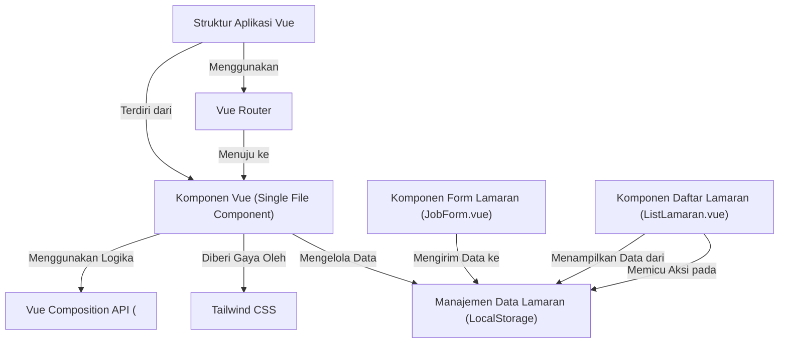

# Pelacak Lamaran Kerja (Job Application Tracker)

Aplikasi web sederhana untuk mencatat, mengatur, dan memantau lamaran kerja. Dibangun menggunakan Vue 3 dan Tailwind CSS, aplikasi ini menyimpan data secara lokal di browser menggunakan `localStorage`, tanpa memerlukan server backend.  
Proyek ini juga dilengkapi fitur **AI untuk membantu penulisan kode** menggunakan model **IBM Granite** melalui API dari **Replicate**.

---

## Deskripsi

Aplikasi ini memungkinkan pengguna untuk:

- Menambahkan, mengedit, dan menghapus data lamaran kerja
- Melihat dan mengelola status lamaran
- Menyimpan data secara otomatis di browser pengguna (localStorage)
- Menggunakan bantuan AI untuk menghasilkan kode berdasarkan prompt

Prompt berada di folder `prompt/` dan hasilnya disimpan di folder `logs/`.

---

## Fitur Utama

- Formulir lamaran kerja interaktif
- Daftar lamaran kerja dengan status
- Validasi form dan render kondisi
- Responsif dan ringan
- Penyimpanan data tanpa backend
- Integrasi dengan AI (IBM Granite via Replicate)

---

## Teknologi yang Digunakan

- Vue 3 (Composition API dengan `<script setup>`)
- Vue Router
- Tailwind CSS
- Vite
- localStorage (untuk penyimpanan data)
- Replicate API dengan model IBM Granite

---

## Penjelasan Dukungan AI

Proyek ini menggunakan **Replicate API** untuk mengakses model **IBM Granite** dalam membantu penulisan kode.  
Integrasi ini dilakukan dengan:

- **Folder Prompt**: `prompt/` (berisi file prompt untuk dikirim)
- **Hasil Generasi**: `logs/` (tempat menyimpan respon AI)
- **API Key**: disimpan di file `.env` dengan format berikut:

```env
REPLICATE_API_TOKEN=masukkan_token_replicate
````

---

## Struktur Proyek (Diagram)



---

## Daftar Bab Tutorial

1. [Struktur Aplikasi Vue](README/01_vue_application_structure.md)
2. [Vue Router](README/02_vue_router.md)
3. [Komponen Vue (SFC)](README/03_vue_components_single_file_components.md)
4. [Manajemen Data (LocalStorage)](README/04_job_data_management_localstorage.md)
5. [Komponen Form Lamaran](README/05_job_form_component_jobform_vue.md)
6. [Komponen Daftar Lamaran](README/06_job_list_component_listlamaran_vue.md)
7. [Vue Composition API (`<script setup>`)](README/07_vue_composition_api_script_setup.md)
8. [Tailwind CSS](README/08_tailwind_css.md)

---

## Cara Menjalankan Proyek

### 1. Cloning Repository

```bash
git clone https://github.com/nama-anda/job-application-tracker.git
cd job-application-tracker
```

### 2. Instal Dependensi

```bash
npm install
```

### 3. Tambahkan Token Replicate ke `.env`

```env
REPLICATE_API_TOKEN=token_anda_disini
```

### 4. Jalankan Aplikasi (Mode Development)

```bash
npm run dev
```

### 5. Build untuk Produksi

```bash
npm run build
```

### 6. Linting Kode

```bash
npm run lint
```

---

## Rekomendasi Setup Editor

* [VSCode](https://code.visualstudio.com/)
* Ekstensi [Volar](https://marketplace.visualstudio.com/items?itemName=Vue.volar)
* Nonaktifkan ekstensi Vetur jika ada
* Tambahkan ekstensi Tailwind IntelliSense (opsional)

---

## License

This project is open-source and free to use for learning purposes. Attribution is appreciated if reused.

---

## Credits

Built with ❤️ by Nana.
AI assistance powered by **IBM Granite** on [Replicate](https://replicate.com/).
Front-end framework by [Vue.js](https://vuejs.org/) and [Tailwind CSS](https://tailwindcss.com/).

```
