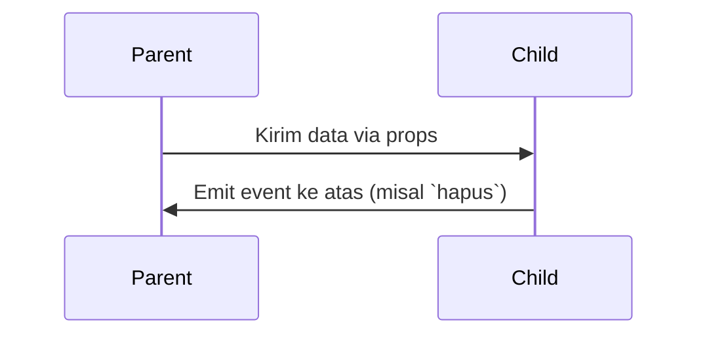

# Chapter 3: Komponen Vue (Single File Component)

Sebelumnya, kita telah mengenal struktur aplikasi dan navigasi via Vue Router. Sekarang kita bahas komponen – elemen dasar pembentuk UI di Vue.

---

## Mengapa Komponen?

Tanpa komponen, aplikasi besar akan sulit dibaca, dipelihara, dan dikembangkan. Komponen membantu memecah antarmuka menjadi bagian-bagian kecil yang terpisah dan dapat digunakan ulang.

---

## Apa Itu Komponen?

Komponen adalah unit UI kecil, seperti:
- `JobForm.vue`: Form input lamaran
- `ListLamaran.vue`: Daftar semua lamaran

---

## Single File Component (.vue)

Setiap `.vue` file berisi 3 bagian utama:

| Bagian              | Fungsi                      |
|---------------------|-----------------------------|
| `<template>`        | Struktur HTML               |
| `<script setup>`    | Logika/JS (data, fungsi)    |
| `<style scoped>`    | CSS hanya untuk komponen ini|

Contoh:

```vue
<template>
  <button @click="hitung++">Klik ({{ hitung }})</button>
</template>

<script setup>
import { ref } from 'vue'
const hitung = ref(0)
</script>

<style scoped>
button { color: white; background: navy; }
</style>
````

---

## Komponen Orang Tua & Anak

Contoh:
`JobTracker.vue` adalah orang tua dari `JobForm.vue` dan `ListLamaran.vue`.

* **Props**: Kirim data dari Parent ke Child
* **Events**: Kirim sinyal dari Child ke Parent

Contoh penggunaan:

```vue
<JobForm :editData="editData" @job-submitted="tambahJobBaru" />
<ListLamaran :dataLamaran="dataLamaran" @hapus="hapusJob" />
```

Child (`ListLamaran.vue`) akan menerima props dan mengirim event:

```js
const props = defineProps(['dataLamaran'])
const emit = defineEmits(['hapus'])
emit('hapus', index)
```

---

## Alur Komunikasi



---

## Ringkasan

| Konsep     | Fungsi                            |
| ---------- | --------------------------------- |
| Komponen   | Unit UI mandiri dan reusable      |
| SFC (.vue) | Satu file untuk HTML, JS, CSS     |
| Props      | Kirim data dari Parent ke Child   |
| Events     | Kirim sinyal dari Child ke Parent |

---

## Penutup

Komponen membantu membuat kode lebih modular, bersih, dan mudah dikelola. Selanjutnya, kita akan bahas bagaimana data lamaran disimpan dan dikelola lewat [LocalStorage](README/04_job_data_management_localstorage.md).
