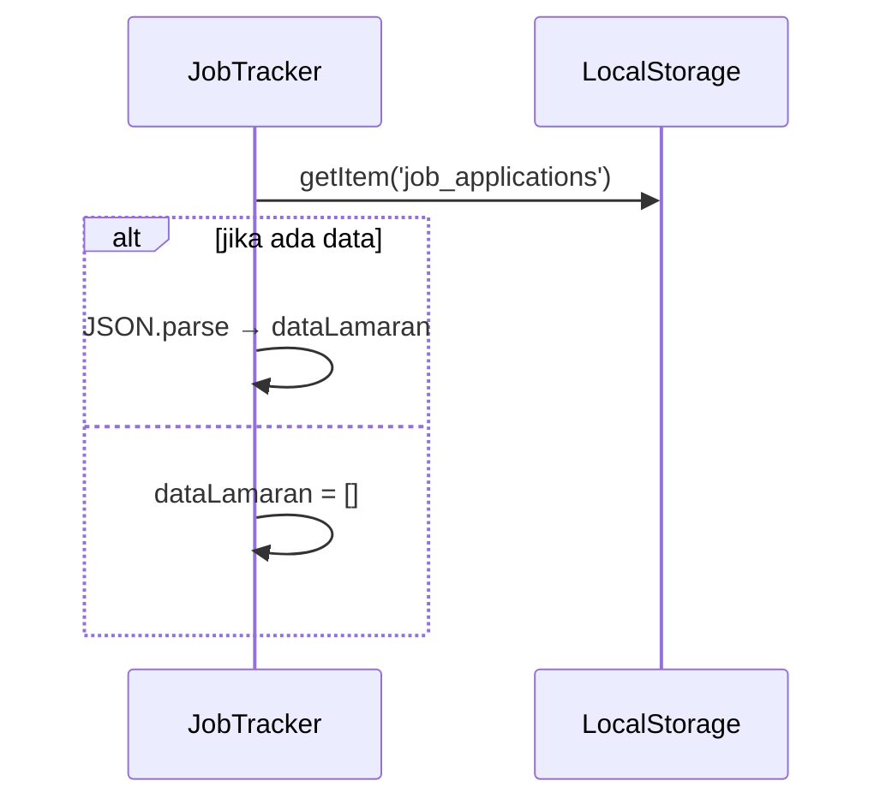
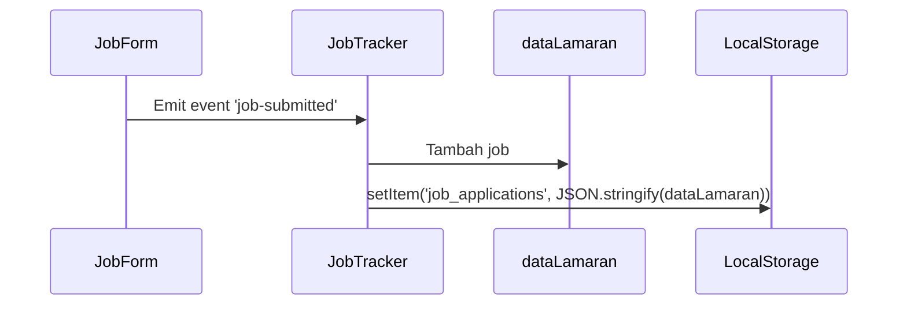

# Chapter 4: Manajemen Data Lamaran (LocalStorage)

Di bab sebelumnya, kita sudah membahas komponen. Sekarang, kita akan membahas bagaimana data lamaran kerja disimpan dan diambil kembali, bahkan setelah browser ditutup.

---

## Masalah: Data Hilang Saat Reload

Tanpa penyimpanan, data lamaran akan hilang tiap kali aplikasi ditutup. Kita butuh sistem **penyimpanan data lokal (persistence)**.

---

## Solusi: `localStorage` Browser

`localStorage` adalah tempat penyimpanan sederhana milik browser, cocok untuk aplikasi ringan seperti ini.

| Fitur            | Penjelasan                        |
|------------------|------------------------------------|
| Lokal            | Hanya tersimpan di browser kamu   |
| Persisten        | Tetap ada meski browser ditutup   |
| Tanpa server     | Tidak perlu backend/database      |
| Simpel           | Mudah digunakan dengan JavaScript |

---

## Fungsi Dasar `localStorage`

| Fungsi                        | Kegunaan                        |
|-------------------------------|---------------------------------|
| `setItem(key, value)`         | Menyimpan data (harus string)  |
| `getItem(key)`                | Mengambil data dari key        |
| `removeItem(key)`             | Hapus satu data                |
| `clear()`                     | Hapus semua data               |
| `JSON.stringify(obj)`         | Objek → String JSON            |
| `JSON.parse(string)`          | String JSON → Objek            |

---

## Di Mana Data Disimpan?

`JobTracker.vue` menyimpan dan mengatur data utama aplikasi di `dataLamaran`.

```js
const dataLamaran = ref([])
````

---

## Load Data Saat Aplikasi Dibuka

```js
onMounted(() => {
  const stored = localStorage.getItem('job_applications')
  dataLamaran.value = stored ? JSON.parse(stored) : []
})
```

---

## Simpan Data Saat Ada Perubahan

Contoh saat tambah data:

```js
function tambahJobBaru(job) {
  dataLamaran.value.push(job)
  localStorage.setItem('job_applications', JSON.stringify(dataLamaran.value))
}
```

Untuk hapus/edit data juga menggunakan pola yang sama: update `dataLamaran`, lalu simpan ke `localStorage`.

---

## Alur Kerja

**Saat Aplikasi Dibuka:**



**Saat Tambah Data Baru:**



---

## Ringkasan

| Konsep           | Fungsi                                           |
| ---------------- | ------------------------------------------------ |
| `localStorage`   | Tempat menyimpan data di browser                 |
| `JSON.stringify` | Ubah data ke string sebelum disimpan             |
| `JSON.parse`     | Ubah string menjadi data JavaScript              |
| `dataLamaran`    | Variabel reactive untuk menyimpan data sementara |
| `onMounted`      | Ambil data saat komponen dimuat                  |
| `setItem`        | Simpan data baru/hasil edit/hapus                |

---

## Penutup

Dengan `localStorage`, aplikasi ini bisa menyimpan data lamaran pengguna tanpa backend. `JobTracker.vue` bertugas mengambil dan menyimpan data saat terjadi perubahan.

Selanjutnya, kita akan bahas komponen form lamaran (`JobForm.vue`) yang digunakan untuk menambahkan dan mengedit data.

➡️ Lanjut ke [Chapter 5: Komponen Form Lamaran (`JobForm.vue`)](README/05_job_form_component_jobform_vue.md)
