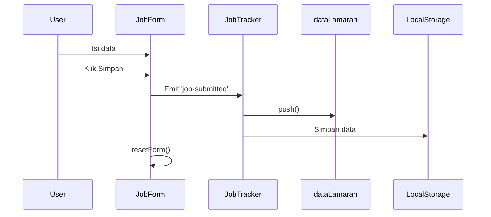
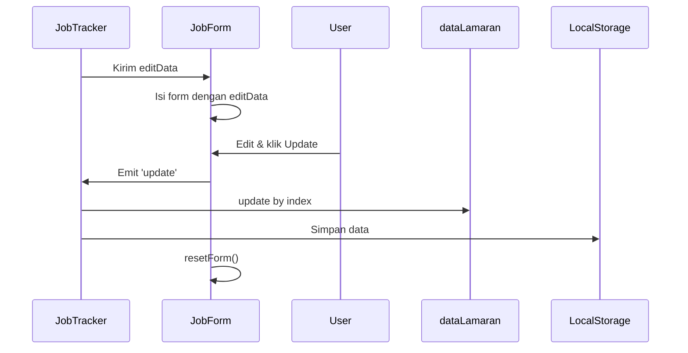

# Chapter 5: Komponen Form Lamaran (`JobForm.vue`)

Di bab sebelumnya, kita sudah belajar menyimpan dan mengambil data menggunakan `localStorage`. Sekarang, kita akan bahas bagaimana data itu **dimasukkan** ke dalam aplikasi — lewat form!

---

## Masalah: Menambahkan dan Mengedit Lamaran

Untuk mencatat lamaran baru atau memperbarui status lamaran, pengguna perlu mengisi form. Tapi meletakkan semua input dan logika di `JobTracker.vue` akan membuatnya terlalu panjang. Solusinya: **buat komponen form terpisah.**

---

## Solusi: `JobForm.vue`

Komponen ini menangani:

1. Input data lamaran (perusahaan, posisi, status, tanggal, catatan)
2. Menyimpan data sementara yang diketik user
3. Validasi form sederhana
4. Mengirim data ke parent (`JobTracker.vue`) untuk disimpan

---

## Struktur `JobForm.vue`

### Template (`<template>`)

Form dengan `v-model`, tombol Simpan/Update, dan validasi:

```vue
<form @submit.prevent="handleSubmit">
  <input v-model="form.company" required />
  <input v-model="form.position" required />
  <select v-model="form.status" required>...</select>
  <input type="date" v-model="form.tanggal_apply" required />
  <textarea v-model="form.catatan"></textarea>

  <button type="submit" :disabled="!validateForm()">
    {{ isEdit ? 'Update' : 'Simpan' }}
  </button>
  <button v-if="isEdit" @click="handleCancel" type="button">Batal</button>
</form>
````

> `v-model` membuat input dan data reactive saling terhubung.

---

### Script (`<script setup>`)

Bagian logika utama:

```js
import { reactive, computed, watch } from 'vue'

const props = defineProps({ editData: Object })
const emit = defineEmits(['job-submitted', 'update', 'cancel'])

const isEdit = computed(() => !!props.editData)

const form = reactive({
  company: '', position: '', status: '', tanggal_apply: '', catatan: '', index: null
})

// Auto-muat data saat edit
watch(() => props.editData, (val) => {
  val ? Object.assign(form, val) : resetForm()
}, { immediate: true })

function validateForm() {
  return form.company && form.position && form.status && form.tanggal_apply
}

function handleSubmit() {
  if (!validateForm()) return
  emit(isEdit.value ? 'update' : 'job-submitted', { ...form })
  resetForm()
}

function handleCancel() {
  emit('cancel')
  resetForm()
}

function resetForm() {
  form.company = ''
  form.position = ''
  form.status = ''
  form.tanggal_apply = ''
  form.catatan = ''
  form.index = null
}
```

---

## Style (`<style scoped>`)

CSS hanya berlaku untuk form ini. Misalnya:

```css
.input {
  @apply w-full px-3 py-2 rounded bg-white/30 text-white;
}
```

---

## Alur Tambah Lamaran



---

## Alur Edit Lamaran



---

## Ringkasan Fungsi Komponen

| Elemen         | Fungsi                                               |
| -------------- | ---------------------------------------------------- |
| `v-model`      | Menghubungkan input dengan data `form`               |
| `reactive`     | Membuat objek `form` jadi reactive                   |
| `defineProps`  | Menerima `editData` dari parent saat mode edit       |
| `watch`        | Mengisi form ketika `editData` berubah               |
| `defineEmits`  | Memberi tahu parent saat submit, update, atau cancel |
| `handleSubmit` | Kirim data ke parent dan reset form                  |
| `handleCancel` | Batalkan edit, reset form, dan beri tahu parent      |
| `resetForm`    | Kosongkan semua field form                           |

---

## Penutup

Komponen `JobForm.vue` bertugas menerima input dari user untuk menambah atau mengedit data lamaran. Ia tidak menyimpan data langsung, tetapi mengirimkannya ke `JobTracker.vue`.

Selanjutnya, kita akan membahas bagaimana daftar lamaran ditampilkan dalam komponen berikutnya.

➡️ Lanjut ke [Chapter 6: Komponen Daftar Lamaran (`ListLamaran.vue`)](README/06_job_list_component_listlamaran_vue.md)
