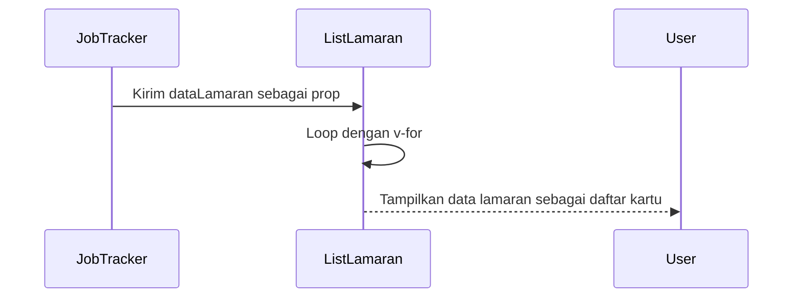
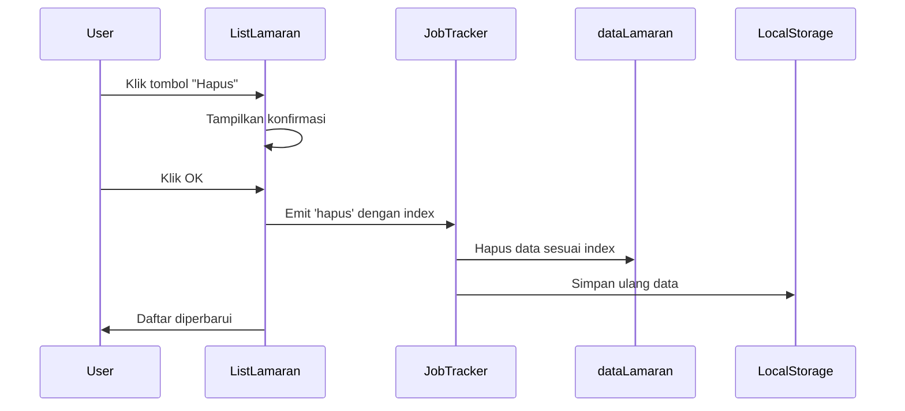

# Chapter 6: Komponen Daftar Lamaran (`ListLamaran.vue`)

Di bab sebelumnya, kita telah membuat form (`JobForm.vue`) untuk menambahkan dan mengedit data lamaran kerja. Sekarang, kita akan menampilkan **daftar** data lamaran tersebut ke dalam antarmuka aplikasi.

---

## Masalah: Menampilkan Banyak Data Lamaran

Menampilkan data mentah apa adanya tentu tidak ramah pengguna. Kita perlu:

- Menyusun data dalam tampilan yang rapi
- Menyediakan tombol "Edit" dan "Hapus" untuk tiap item

Namun, jika logika daftar ini dimasukkan langsung ke `JobTracker.vue`, komponen tersebut akan menjadi terlalu rumit. Maka, kita pisahkan menjadi komponen khusus bernama `ListLamaran.vue`.

---

## Solusi: Komponen `ListLamaran.vue`

Tugas utama `ListLamaran.vue`:

1. Menerima daftar lamaran (`dataLamaran`) dari parent
2. Menampilkan setiap lamaran secara rapi
3. Memberi tombol aksi (Edit, Hapus) untuk setiap item
4. Mengirim sinyal kembali ke parent saat tombol diklik

---

## Struktur `ListLamaran.vue`

### Script (`<script setup>`)

```js
import { PencilSquareIcon, TrashIcon, DocumentTextIcon, CalendarDaysIcon } from '@heroicons/vue/24/solid'

const props = defineProps(['dataLamaran'])
const emit = defineEmits(['hapus', 'edit'])

function hapus(index) {
  if (confirm('Yakin ingin menghapus lamaran ini?')) emit('hapus', index)
}

function edit(index) {
  emit('edit', index)
}

function formatTanggal(tgl) {
  if (!tgl) return '-'
  const date = new Date(tgl)
  return date.toLocaleDateString('id-ID', { day: 'numeric', month: 'long', year: 'numeric' })
}
````

> Komponen ini hanya **menerima data dan memberi sinyal ke atas**, tidak menyimpan apa-apa sendiri.

---

### Template (`<template>`)

```vue
<div v-if="dataLamaran.length">
  <div v-for="(lamaran, index) in dataLamaran" :key="index">
    <h3>{{ lamaran.company }}</h3>
    <p>Posisi: {{ lamaran.position }}</p>
    <p>Tanggal Apply: {{ formatTanggal(lamaran.tanggal_apply) }}</p>
    <p>Status: {{ lamaran.status }}</p>
    <p>Catatan: {{ lamaran.catatan || '-' }}</p>

    <button @click="edit(index)">Edit</button>
    <button @click="hapus(index)">Hapus</button>
  </div>
</div>
<div v-else>
  Belum ada data lamaran.
</div>
```

> Gunakan `v-for` untuk me-loop data dan `@click` untuk menangkap aksi.

---

### Gaya (`<style scoped>`)

Biasanya kita menggunakan Tailwind CSS di sini. Misalnya:

```css
.card {
  @apply bg-white/20 p-4 rounded-lg text-white shadow-md;
}
```

---

## Alur Interaksi

### Menampilkan Daftar



### Menghapus Data



---

## Ringkasan Fungsi Komponen

| Elemen          | Fungsi                                          |
| --------------- | ----------------------------------------------- |
| `defineProps`   | Menerima data dari parent (`dataLamaran`)       |
| `defineEmits`   | Mendeklarasikan event `hapus` dan `edit`        |
| `v-for`         | Menampilkan daftar data sebagai elemen berulang |
| `@click`        | Menangani aksi user (Edit/Hapus)                |
| `emit()`        | Mengirim aksi ke parent untuk diproses          |
| `formatTanggal` | Memformat tanggal jadi lebih user-friendly      |

---

## Penutup

Komponen `ListLamaran.vue` hanya bertugas **menampilkan data** dan menangani interaksi dari user. Ia tidak mengelola data secara langsung — semua pengolahan dilakukan di `JobTracker.vue`.

Selanjutnya, kita akan memahami lebih dalam tentang cara kerja bagian `<script setup>` dan Composition API di Vue 3.

➡️ Lanjut ke [Chapter 7: Vue Composition API (`<script setup>`)](README/07_vue_composition_api_script_setup.md)
